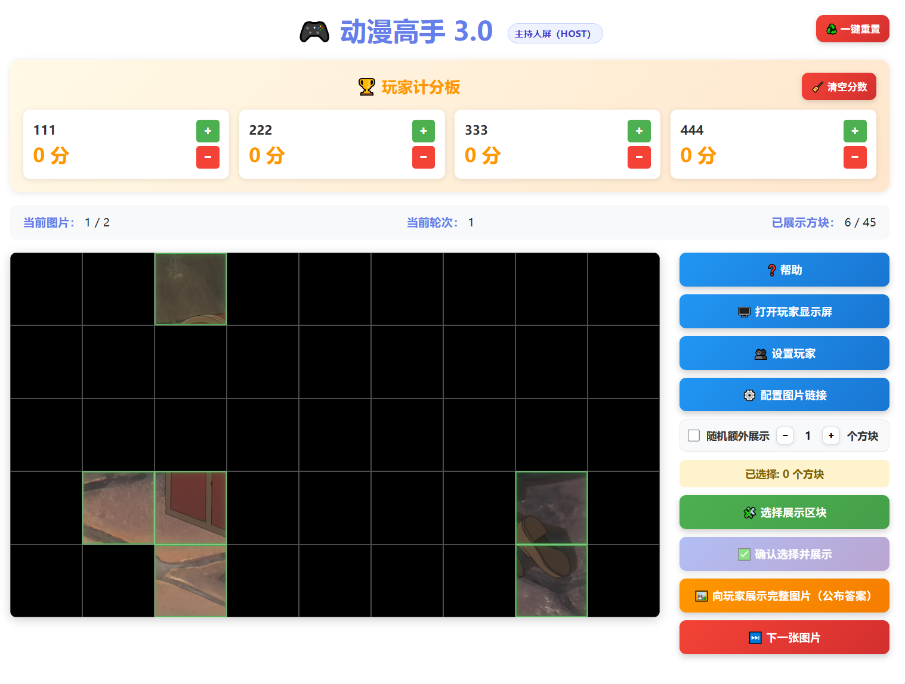
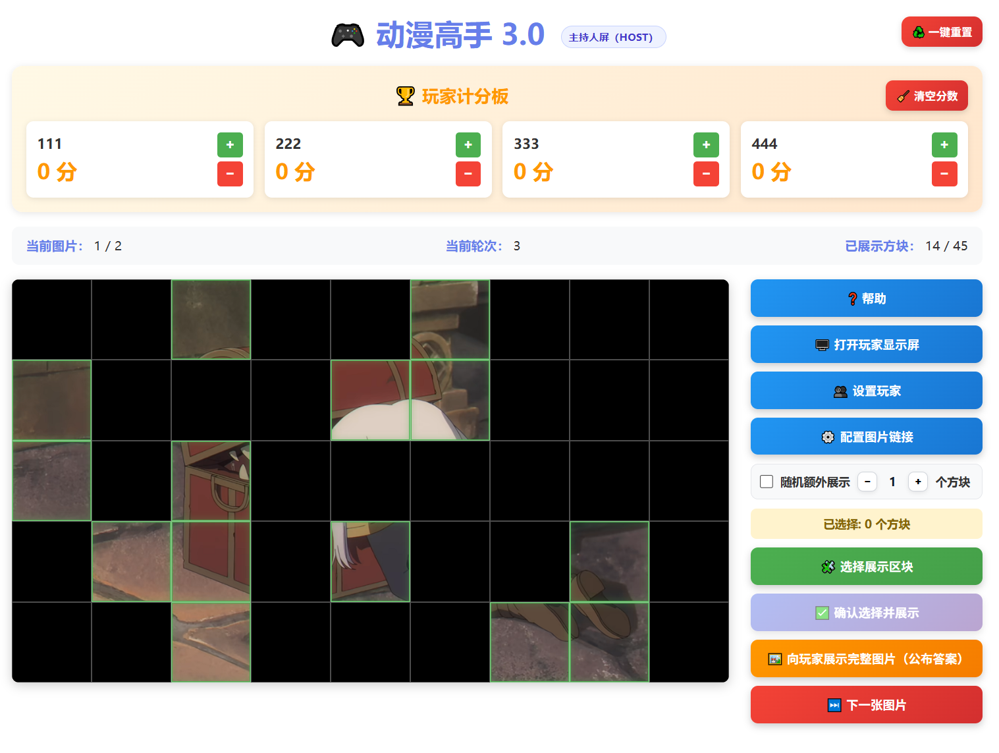
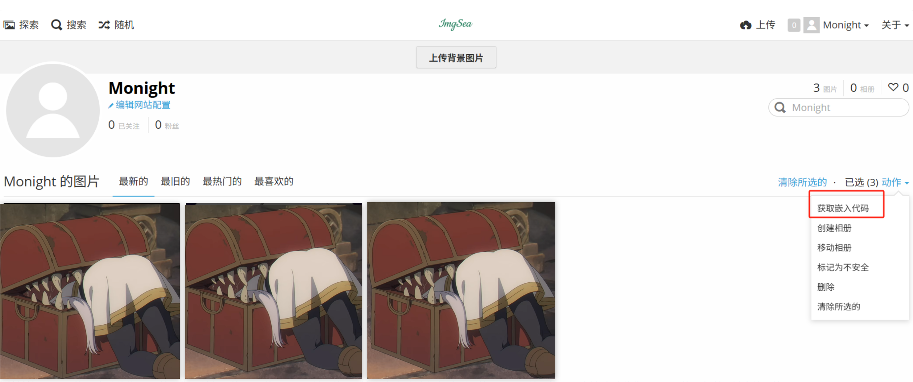
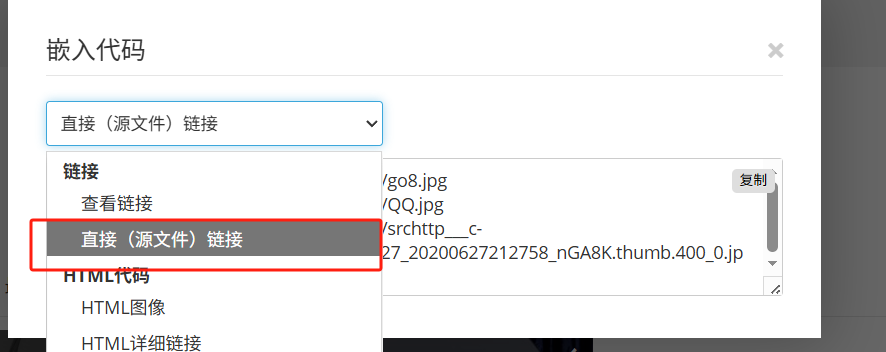

# 动漫高手3.0

[游戏链接](https://davy-chendy.github.io/anime-master-game/)

## 引言

todo

## 玩法介绍

完整图片被分割并遮挡

主持人逐步揭开部分区域，玩家根据当前画面猜出对应的动画作品

展示区域会随轮次逐渐增多，直到有人猜中为止

### 示例

初始只显示少量区域：


多轮后逐渐揭开：



## 🖼 如何把本地图片批量转成可用链接（图床方式）

本游戏题库需要使用**图片链接（URL）**。 如果只有本地图片，请先用图床转换成链接。

以 **ImgSea 图床（https://imgsea.com）** 为例：

### 第一步：上传图片

1. 打开：https://imgsea.com   注册并登录账号  
3. 上传你的图片（支持多选）

### 第二步：获取嵌入代码

进入个人主页后：

1. **全选图片**
2. 点击：**获取嵌入代码**




### 第三步：选择“直接（源文件）链接”

在弹出的选项中选择：

👉 **直接（源文件）链接 / 图片URL链接**




### 第四步：复制链接使用

你会得到一批图片链接，例如：

```txt
https://imgsea.com/xxxx.jpg
https://imgsea.com/yyyy.png
https://imgsea.com/zzzz.webp
```
复制进游戏即可作为题库


## 规则（自用）
### 基本要求

- 参与人数：5 人
- 每人准备 20 张图片，共 100 张
- 图片范围限定为 **2005 年后日本动画** 的截图
  - 包括日本动画电影
  - 不包括真人剧

### 游戏流程概述

- 游戏共进行 100 题
- 每一题由一名玩家担任 **出题者**，其余玩家为 **答题者**
- 出题者仅负责自己的题库，展示图片与选择遮挡区域，不参与本题抢答

### 出题与展示方式

- 出题者从自己准备的 20 张图片中选择一张作为题目
- 初始时，图片被划分为 **5 × 9 共 45 个大小相同的方块**，全部被遮挡
- 题目将分多轮进行展示：
  - 每一轮：
    - 出题者自行选择 **4 个方块**进行展示
    - 系统随机额外展示 **1 个方块**（出题者事先不知道随机方块的位置）
- 每轮展示完成后，进入抢答阶段
- 若无人抢答，则进入下一轮，继续展示新的方块
- 若 45 个方块全部展示完毕仍无人抢答，则本题结束

### 抢答规则

- 每一轮展示后，设置 **10 秒抢答时间**
- 抢答采取自由抢答制，允许多人在同一轮同时抢答
- 每名答题者在同一题目中 **仅有一次抢答机会**
- 未抢答的玩家可以一直选择不参与抢答

#### 同时抢答的处理方式

- 若多人同时抢答，由 **出题者指定作答顺序**
- 按顺序依次作答：
  - 若排在前面的玩家回答正确，则本题立即结束，仅该玩家视为答对
  - 若前一位玩家回答错误，则下一位抢答玩家 **必须作答**
  - 若该玩家拒绝作答，则视为回答错误
- 所有抢答但未答对的玩家，在本题中 **失去后续抢答资格**

### 关于“无法猜出”的判定

- 游戏中不存在主动声明“无法猜出”的行为
- 若一名答题者 **直到图片 45 个方块全部展示完毕仍未进行抢答**，则视为该玩家本题“无法猜出”

### 积分规则

- 当 **有且仅有一位答题者首次抢答并回答正确** 时：
  - 该答题者 **+1 分**
  - 出题者 **+1 分**
- 当 **所有答题者都进行抢答，且全部回答错误** 时：
  - 出题者 **+1 分**
- 当 **图片全部展示完毕，且至少有一名答题者未进行抢答** 时：
  - 所有答题者 **各 +1 分**

### 补充说明

- 出题者在本题中不参与抢答与得分判定（仅通过积分规则获得分数）
- 所有得分情况均以题目结束时的状态为准
- 游戏以总积分高低决定最终排名


